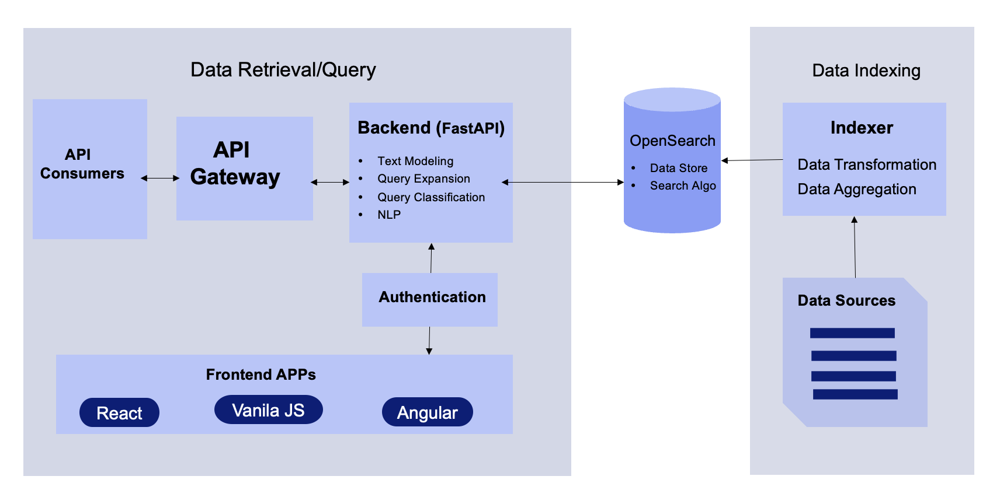

# People Search

A powerful people search application built with React.js, FastAPI, and OpenSearch. This full-stack project provides a modern web interface and REST API to search and index people data, with support for both local Docker deployments and AWS OpenSearch.

## Architecture



## Features

- ⚛️ **React.js Frontend**: Modern, responsive user interface (coming soon)
- 🔍 **Advanced Search**: Multi-field keyword search with fuzzy matching
- 📊 **OpenSearch Integration**: Built on OpenSearch for scalable and fast search capabilities
- 🐳 **Docker Support**: Easy local development with Docker Compose
- ☁️ **AWS Compatible**: Supports AWS OpenSearch with IAM authentication
- 📡 **REST API**: FastAPI-based RESTful API with automatic documentation
- 🔄 **Data Indexing**: Automated data ingestion from external APIs
- 📈 **OpenSearch Dashboards**: Pre-configured dashboard for data visualization

## Project Structure

```
people-search/
├── data_indexer/          # Data indexing scripts
│   └── indexer.py         # Fetches and indexes user data
├── data_retrieval/        # API layer
│   └── controller.py      # FastAPI search endpoints
├── frontend/              # Frontend application (React.js)
│   └── README.md          # Frontend documentation
├── opensearch_settings/   # OpenSearch configurations
│   ├── migrations.py      # Index schema migrations
│   ├── schema/            # Index mappings and settings
│   ├── scripts/           # OpenSearch scripts
│   └── templates/         # Query templates
├── docker-compose.yml     # Local Docker setup
└── requirements.txt       # Python dependencies
```

## Prerequisites

- Python 3.9+
- Node.js 16+ and npm (for React.js frontend - coming soon)
- Docker and Docker Compose
- (Optional) AWS credentials for AWS OpenSearch

## Quick Start

### 1. Clone the Repository

```bash
git clone https://github.com/tarun-nagpal-github/people-search.git
cd people-search
```

### 2. Set Up Python Environment

```bash
# Create virtual environment
python -m venv virtual_env

# Activate virtual environment
source virtual_env/bin/activate  # On macOS/Linux
# or
virtual_env\Scripts\activate  # On Windows

# Install dependencies
pip install -r requirements.txt
```

### 3. Start OpenSearch with Docker

```bash
docker-compose up -d
```

This will start:
- **OpenSearch** on `http://localhost:9200`
- **OpenSearch Dashboards** on `http://localhost:5601`

Wait for the services to be healthy (usually takes 30-60 seconds).

### 4. Index Sample Data

```bash
# Set environment variable for local mode
export LOCAL=True

# Run the indexer
python data_indexer/indexer.py
```

This will fetch user data from randomuser.me API and index it into OpenSearch.

### 5. Start the API Server

```bash
cd data_retrieval
python controller.py
```

The API will be available at `http://localhost:8000`

### 6. Access API Documentation

- **Swagger UI**: http://localhost:8000/docs
- **ReDoc**: http://localhost:8000/redoc

## Configuration

### Environment Variables

Create a `.env` file in the project root:

```env
# Local mode (use Docker OpenSearch)
LOCAL=True
OPENSEARCH_HOSTS=localhost
OPENSEARCH_USERNAME=
OPENSEARCH_PASSWORD=
OPENSEARCH_CONNECTION_TIMEOUT=60

# AWS mode (use AWS OpenSearch)
# LOCAL=False
# OPENSEARCH_HOSTS=your-opensearch-domain.es.amazonaws.com
# AWS_REGION=us-east-1
```

### Local Development

By default, the application uses local OpenSearch via Docker:
- No authentication required
- SSL disabled
- Runs on `localhost:9200`

### AWS OpenSearch Configuration

For AWS OpenSearch, set:
- `LOCAL=False`
- `OPENSEARCH_HOSTS` to your AWS OpenSearch domain
- Ensure AWS credentials are configured (via `~/.aws/credentials` or environment variables)

## API Endpoints

### Search People

```bash
GET /search?keyword=<search_term>&page=1&size=10
```

**Parameters:**
- `keyword` (required): Search keyword
- `index_name` (optional): OpenSearch index name (default: "expertise")
- `page` (optional): Page number (default: 1)
- `size` (optional): Results per page (default: 10, max: 100)
- `fields` (optional): Comma-separated list of fields to search

**Example:**
```bash
curl "http://localhost:8000/search?keyword=john&page=1&size=10"
```

### Health Check

```bash
GET /health
```

Returns OpenSearch cluster information and connection status.

### Root Endpoint

```bash
GET /
```

Returns API information and available endpoints.

## Search Features

The search endpoint supports:
- **Multi-field search**: Searches across name, email, location, phone, etc.
- **Fuzzy matching**: Handles typos and variations automatically
- **Field boosting**: Prioritizes matches in name fields
- **Highlighting**: Returns highlighted search terms in results
- **Pagination**: Efficient result pagination

### Default Search Fields

- `name.first` (boosted)
- `name.last` (boosted)
- `email`
- `location.city`
- `location.state`
- `location.country`
- `phone`
- `cell`
- `nat` (nationality)
- `gender`

## OpenSearch Dashboards

Access OpenSearch Dashboards at http://localhost:5601 to:
- Visualize indexed data
- Create custom dashboards
- Run advanced queries
- Monitor cluster health

## Development

### Running Tests

```bash
# Test OpenSearch connection
python data_indexer/indexer.py
```

### Project Components

1. **Frontend** (`frontend/`):
   - React.js application (coming soon)
   - Modern, responsive user interface
   - Integration with the People Search API

2. **Data Indexer** (`data_indexer/indexer.py`):
   - Fetches user data from APIs
   - Indexes data into OpenSearch
   - Handles index creation and updates

3. **API Controller** (`data_retrieval/controller.py`):
   - FastAPI application
   - Search endpoints with pagination
   - Health check endpoints

4. **OpenSearch Migrations** (`opensearch_settings/migrations.py`):
   - Manages index schemas
   - Handles index creation and updates
   - Configures analyzers and mappings

## Technologies Used

### Frontend
- **React.js**: Modern JavaScript library for building user interfaces (coming soon)

### Backend
- **FastAPI**: Modern Python web framework
- **Uvicorn**: ASGI server

### Search & Data
- **OpenSearch**: Distributed search and analytics engine
- **OpenSearch-py**: Python client for OpenSearch

### Infrastructure
- **Docker**: Containerization
- **Boto3**: AWS SDK for Python (for AWS OpenSearch)

## Troubleshooting

### OpenSearch Connection Issues

1. Verify Docker containers are running:
   ```bash
   docker-compose ps
   ```

2. Check OpenSearch health:
   ```bash
   curl http://localhost:9200/_cluster/health
   ```

3. Verify environment variables:
   ```bash nostml
   echo $LOCAL
   echo $OPENSEARCH_HOSTS
   ```

### Port Conflicts

If ports 9200 or 5601 are already in use, modify `docker-compose.yml` to use different ports.

## Contributing

Contributions are welcome! Please feel free to submit a Pull Request.

## License

This project is open source and available under the MIT License.

## Author

**Tarun Nagpal**

- GitHub: [@tarun-nagpal-github](https://github.com/tarun-nagpal-github)

## Acknowledgments

- Data source: [Random User API](https://randomuser.me/)
- Built with [FastAPI](https://fastapi.tiangolo.com/)
- Powered by [OpenSearch](https://opensearch.org/)

